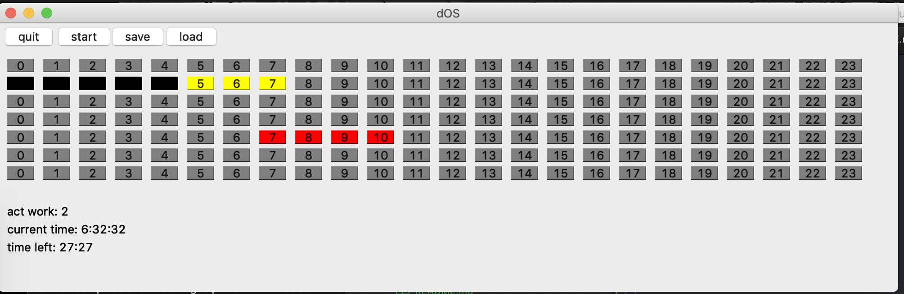

# dOS
manage time with help of somem blocks

# blocks

colors:
- yellow (learn)
- red (work)
- grey (free time)
- black (sleep)

size:
- one (30min)
- two (1hrs)
- four (2hrs)
- six (3hrs)
- eight (4hrs)
- ten (5hrs)
- twelfe (6hrs)
- sixteen (8hrs)

# gui (front)
## pretotype
- qt5


## prototype
- flask webpage
- metrics and statistics

# data (back)

## pretotype
- python3 for code and local data.json

## prototype
- onlineDB
- oAuth login

### data
#### version 1
the data is stored in data.json
- 2019, 3 -> year, calendarweek
- 0-167 -> hours per week

```
{
  "(2019, 3))": {
    "0": 0,
    "1": 0,
    ...
    "167": 2
  },
  "(2019, 4)": {
    "0": 1,
    "1": 2,
    ...
    "167": 0
  }
```
#### version 2
year, calendarweek, weekhour
```
{
  2019: {
    3:{
      0: 0,
      1: 0,
      ...
      167: 2
    },
    4:{
      0: 0,
      1: 0,
      ...
      167: 2
      }  
    }
  },
  2018: {
    5:{
      0: 1,
      1: 2,
      ...
      167: 0  
    }
  }
```
